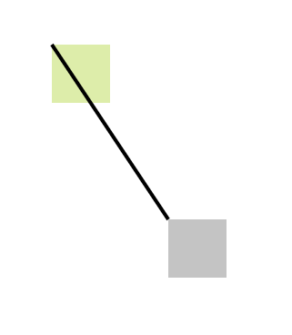
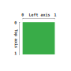
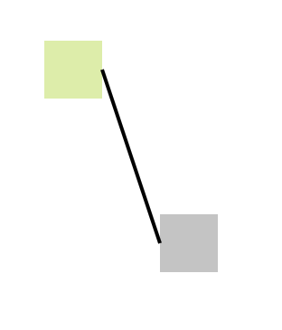

# 🏹 SVG DOM Arrows

Draw an arrow from one HTML element to another with a simple API and 0 dependencies.

## How to get started? ✨

To get started, you'll need 3 things:

* Your starting DOM element.
* Your ending DOM element.
* The style of your SVG path.

Simple implementation:

```ts
    const options: PathOptions = {
      start: {
        element: document.getElementById('myGreenBox'),
      },
      end: {
        element: document.getElementById('myGreyBox'),
      },
      style: 'stroke:black;stroke-width:4;fill:transparent',
      appendTo: document.body, // Optional
    };
    const arrow = new LinePath(options);

    // Output

    arrow = {
        conainerDiv: HTMLDivElement,// The generated div containing the SVG element
        startBbox: DOMRect, // Internal object used by the class to calculate the arrow path
        endBbox: DOMRect, // Internal object used by the class to calculate the arrow path
        options: PathOptions, // The options object passed
        svgElement: SVGSVGElement, // The generated SVG element conaining the path
        svgPathLine: SVGPathElement, // The generated path
    };
```

**ℹ Note:** If you don't specify the `appendTo` option, the SVG path will be rendered but not appended to the document. It will be up to you to append it to a `div` for example.

Below a screenshot resulting from the code:



Below some demos using vanilla TS/JS and other frameworks/

### Demos ✨

You can checkout some demos here with few libs and frameworks so you can get yourself started with the implementation. In a way, `svg-dom-arrows` will work with anything, it has no dependencies and just uses plain DOM elements. But just in case, I've tried it with Angular, Vue and React as you can see below:

* [Vanilla demo](https://stackblitz.com/edit/svg-dom-arrows-demo?file=index.ts)
* [Angular Demo](https://stackblitz.com/edit/svg-arrow-dom-angular?file=src/app/arrow.demo/arrow.demo.component.ts)
* [Vue Demo](https://stackblitz.com/edit/svg-dom-arrow-vue?file=src/components/ArrowDemo.vue)
* [React Demo](https://stackblitz.com/edit/svg-dom-arrows-react-h2dg88?file=src/ArrowDemo.js)

### Positionning ➕

Positionning is based on a left and top axis, below a simple visualization of how the axies are based on the element. 0 is at the left of the element, 1 would be at 100% left from the origin.



You might have noticed that the drawn path starts from position 0,0 of `myGreenBox` to 0,0 at `myGreyBox`. If no position is specified, the tool will assume you want it to start from 0,0. You can of course set the position as you like as follows:

```ts
    const options: PathOptions = {
      start: {
        element: document.getElementById('myGreenBox'),
        position: {
          top: .5, // 0 being the top of the element
          left: 1, // 0 is at the right of the element
        },
      },
      end: {
        element: document.getElementById('myGreyBox'),
        position: {
          top: .5,
          left: 0,
        },
      },
      style: 'stroke:black;stroke-width:4;fill:transparent',
      appendTo: document.body,
    };
    const arrow = new LinePath(options);
```

The result would be as follows:



**ℹ Note:** 0 to 1 are the max values inside the BBox of the DOM element. This does not mean that you're limited to those values. You can experiment with negative values or < 1 values.

### Styling 🎨

The `style` options will be copied directley to the SVG path's style attribute. This being an SVG, it's a little bit different than the usual CSS. Besides what's mostly imporant is that:

* `stroke:<color>` to set the color of the line.
* `stroke-width:<number>` to set the thickness of your line.
* `fill:transparent` to keep only the line and avoid having a default black color.

## 💻 How to run the developement server ?

Easy, run this command and your server will be on `http://localhost/3000`:

```bash
npm start
```

## 🆘 Issues and contributions

If you have an issue with this library or want to contribute, please let me know I'll be happy to interact with you.

## ⏲ Changelog

- v2.0.1: Fixed issue with typings not being packaged.
- v2.0.0a: Rewrote from the ground up the full API and implementation.
- v1.0.0: Forked and improved from [sasza2/arrows](https://github.com/sasza2/arrows)
